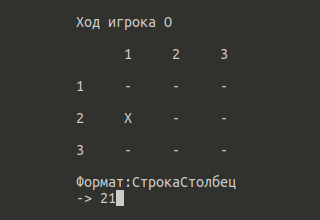
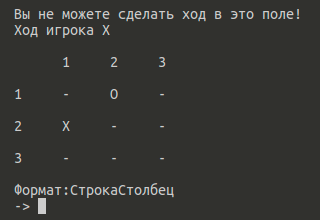
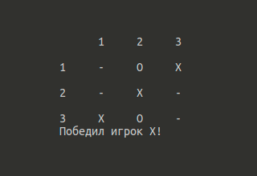

# B5.6
Консольная версия игры "Крестики-нолики"

Первый ход предоставляется игроку X.
Ход осуществляется путем ввода координат соответствующих строке и столбцу, например 12 - 1я строка 2й столбец.

Нельзя сделать ход по координатам, по которым уже находится X или 0.

Первый, выстроивший в ряд 3 своих фигуры по вертикали, горизонтали или диагонали, выигрывает.
